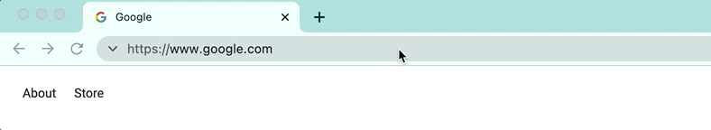
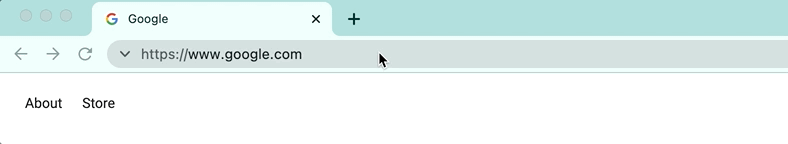
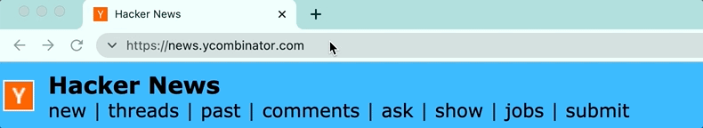
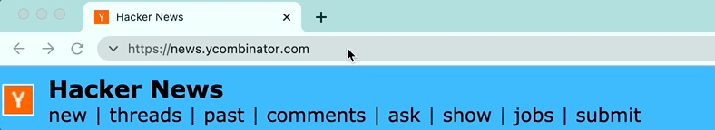

# ★ Omnibookmarks

The [Omnibookmarks browser extension](https://chrome.google.com/webstore/detail/omnibookmarks/ahacopipkbdhmgjlkbnkpoafeakjjkkj) is **the fastest way to open bookmarks**. Just type a keyword into the address bar to quickly open or add a bookmark:



Get Omnibookmarks from the [Chrome Web Store](https://chrome.google.com/webstore/detail/omnibookmarks/ahacopipkbdhmgjlkbnkpoafeakjjkkj) or the [FireFox Add-Ons](https://addons.mozilla.org/en-US/firefox/addon/omnibookmarks) site.

## Benefits

⚡️ Lightning fast

📖 Saves to the browser's built-in bookmarks folder

🔐 Open source, with [simple source code](background.js) that is easy to audit and trust


## Usage

First, activate Omnibookmarks by typing the letter "b" into the address bar, followed by a space:

<p align="center">
  
</p>

### Adding a bookmark

To add a bookmark for the current page, type "+" followed by the keyword you want to assign it, and press Enter:

<p align="center">
  
</p>

### Opening a bookmark

To open a bookmark you previously added, type its keyword and press Enter:

<p align="center">
  
</p>

### Removing a bookmark

To remove a bookmark you previously added, type "-" followed by its keyword, and press Enter:

<p align="center">
  
</p>

### Viewing all bookmarks

Omnibookmarks saves pages to a bookmarks folder named "Omnibookmarks". This folder is placed in "Other Bookmarks" by default, but you can move it to a different location if you want to.

## Supported browsers

Omnibookmarks supports most desktop browsers:

- [Chrome](https://chrome.google.com/webstore/detail/omnibookmarks/ahacopipkbdhmgjlkbnkpoafeakjjkkj)
- [FireFox](https://addons.mozilla.org/en-US/firefox/addon/omnibookmarks)
- [Edge](https://chrome.google.com/webstore/detail/omnibookmarks/ahacopipkbdhmgjlkbnkpoafeakjjkkj) (v79+)
- [Opera](https://chrome.google.com/webstore/detail/omnibookmarks/ahacopipkbdhmgjlkbnkpoafeakjjkkj)
- [Brave](https://chrome.google.com/webstore/detail/omnibookmarks/ahacopipkbdhmgjlkbnkpoafeakjjkkj)

Omnibookmarks doesn't support the following browsers:

- Safari (doesn't support [omnibox](https://developer.mozilla.org/en-US/docs/Mozilla/Add-ons/WebExtensions/API/omnibox))
- Mobile browsers
- Legacy Edge (v18 and older)

## Development

To create a release for Chromium-based browsers (Chrome, Edge, Opera):

```sh
# Creates a release at dist/omnibookmarks-chromium
./scripts/package-chromium.sh
```

To create a release for FireFox:

```sh
# Creates a release at dist/omnibookmarks-firefox
./scripts/package-firefox.sh
```

## Inspiration

Omnibookmarks is heavily inspired by Hashmem, an extension that is no longer available. Hashmem provided the same approach for saving and opening URLs, but it had several significant drawbacks:

- Removed from the Chrome Web Store for an unnamed policy violation and was also unavailable for FireFox.
- Required granting the extension permission to send HTTP requests to several URLs controlled by the author.
- Not open source, and its JavaScript files were obfuscated.
- Saved bookmarks using the extension storage API instead of saving them to the browser's built-in bookmarks database.

So, Omnibookmarks seeks to provide a replacement for Hashmem without these drawbacks.
